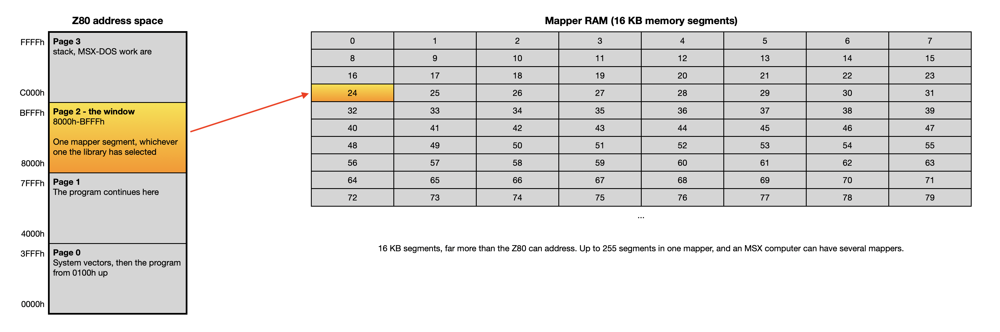
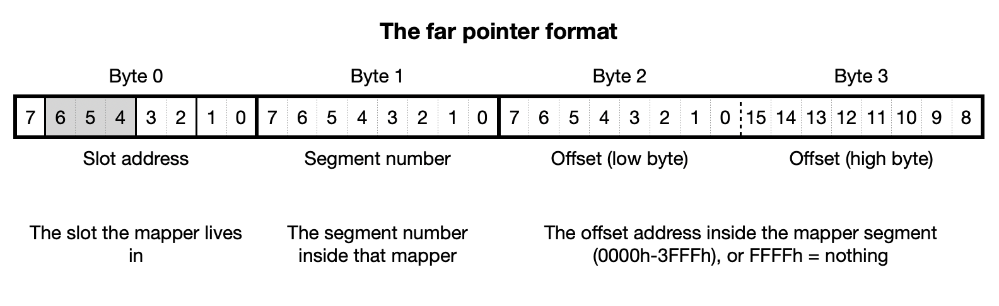
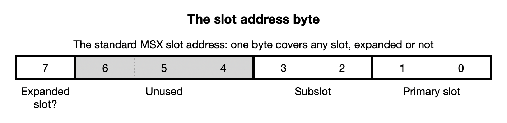

# MapperHeap — a memory-mapper heap for MSX-DOS2

Version 1.0.0

MapperHeap gives an MSX-DOS2 program a general-purpose heap (allocate a
block, use it, give it back) with the blocks living in **memory-mapper RAM**
instead of in the Z80's 64 KB address space. All of the mapper RAM in the
machine is available: the internal mapper, mappers in expanded slots, and
cartridge mappers, all of them, up to the 4 MB per mapper that MSX-DOS2
itself can address.

MapperHeap is one relocatable module, `alloc.as`, with six routines and one
variable in its public interface.

## The problem it solves

A Z80 sees 64 KB at a time, and a program does not get all of it. The bottom
256 bytes hold the system vectors, among them the BDOS entry point at 0005h;
page 3 holds the stack and MSX-DOS's work area. MSX-DOS loads the program at
0100h and it occupies memory upward from there, through the rest of page 0 and
into page 1 and beyond, as far as its size requires. A program that needs to
hold a lot of data in memory therefore runs out of address space long before it
runs out of RAM. The machine may well have 512 KB, 1 MB or 4 MB of mapper RAM
that the program is not using.

There are three conventional approaches, each with drawbacks: hold the data
on disk and accept the loss of speed; build the program around a fixed set of
hand-managed buffers; or program the mapper hardware directly, tracking which
16 KB segment is visible at any moment, throughout the program.

MapperHeap manages the mapper hardware on the program's behalf. It uses
**page 2** (8000h–BFFFh) as a window, requests 16 KB segments from MSX-DOS2 as
they are needed, and divides them into blocks of the size the program
requests. A
block is named by a 4-byte **far pointer** that stays valid for the block's
whole life, no matter what the window currently shows. To touch the block,
the program hands the far pointer to `deref` (in `alloc.as`) and gets back an
ordinary 16-bit address inside page 2.



## Why you would want it

- **Capacity is limited by installed RAM, not by address space.** The amount
  of data a program can hold is set by the mapper RAM in the machine, not by
  the 64 KB the Z80 can address.
- **Ordinary allocate and free.** Variable-sized blocks, any mix of sizes,
  freed in any order. Freed blocks that happen to be next to each other in
  the same segment merge back into one larger block automatically, so the
  heap does not fragment over a long run.
- **Every mapper, no configuration.** Segments are requested from MSX-DOS2,
  which supplies whatever free segments it has, from whichever mapper. Nothing needs to be
  told how much RAM the machine has or where it is.
- **Compatible with MSX-DOS2 and other resident software.** Segments come
  from MSX-DOS2's own allocator, so the heap coexists with the RAM disk, with
  resident utilities and with MSX-DOS2 itself, and MSX-DOS2 reclaims every
  segment when the program ends.
- **Small.** One module, six routines, no configuration, no initialisation
  table to fill in.

What it is **not**: it is not a virtual memory system. A block never straddles
two segments, so the largest single block is 16372 bytes, and a block is only
addressable while its segment is in the window.

## The files

| file | what it is | needed to build your program? |
|---|---|---|
| `alloc.as` | MapperHeap itself | yes — assemble and link it |
| `alloc.inc` | external declarations for the library's routines | yes — include it |
| `farptr.inc` | far-pointer equates and macros | yes — `alloc.as` includes it |
| `dos2func.inc` | MSX-DOS function number equates | only if you call BDOS |
| `dos2chec.as` | MSX-DOS2 detector | only if you want the check |
| `examples/` | five short example programs | no |
| `tests/` | the stress test program and its helpers | no |
| `doc/` | the rest of the documentation | no |

In more detail:

**`alloc.as`** — MapperHeap itself, one file, in two layers. The lower layer
talks to the mapper: it finds MSX-DOS2's mapper support routines at start-up,
claims 16 KB segments, and switches the window. The upper layer is the heap
proper: it divides segments into blocks, keeps a list of the free ones, and
merges neighbours when a block comes back. Six routines and one variable are
public — `heapinit`, `halloc`, `hfree`, `deref`, `p2restore`, `maptot` and
`hblocks`. Everything else (`mapinit`, `allocseg`, `newseg`, `flremove`,
`fladd`, and the copy of MSX-DOS2's mapper jump table) is private to the file.

**`alloc.inc`** — one `external` declaration per public name, each with a
comment giving its inputs, outputs and error signal. Include it in any module
that calls the library. It declares nothing else and generates no code.

**`farptr.inc`** — the equate `NULLOFF` (the offset value FFFFh, meaning "no
block") and six macros that name the things every program does with far
pointers: copy one (`fpcopy`), copy one out of the window (`fpsave`), test one
for null (`fpnull`), map one (`derefp`), allocate a block (`fpalloc`) and free
one (`fpfree`). `alloc.as` includes this file and uses the first four
throughout; your program may use all six. They expand inline
— see [doc/api.md](doc/api.md#the-far-pointer-macros-farptrinc) for what each
one clobbers.

**`dos2func.inc`** — the MSX-DOS function numbers as named equates
(`_STROUT`, `_TERM0`, `_DOSVER` and the rest, 92 of them). Equates only: it
does **not** define the `BDOS` entry address or a `system` macro, so a program
that uses it defines those itself. The quick start below shows the three
lines involved.

**`dos2chec.as`** — one small relocatable module exporting one routine,
`dos2check`, which asks MSX-DOS for its version number and returns with carry
set if this is not MSX-DOS2. It includes nothing and depends on nothing, so it
drops into any program. The library needs MSX-DOS2; this is how a program
finds out politely instead of crashing.

## Requirements

- **MSX-DOS2.** MapperHeap is built on MSX-DOS2's mapper support routines,
  which MSX-DOS1 does not have. Check with `dos2check` (in `dos2chec.as`) and
  exit with a message if the check fails.
- **A memory mapper.** `heapinit` (in `alloc.as`) returns with carry set if
  the machine has no mapper support.
- **An M80-compatible assembler and linker** producing `.rel` modules. Macros
  with parameters, and `ifndef`/`endif`, are used — both are standard M80.
  MapperHeap was developed with SOLID `as` and `ld`.

Assembling and linking:

```
as myprog.as
as alloc.as
ld myprog=myprog,alloc
```

If you use the MSX-DOS2 check as well:

```
as myprog.as
as alloc.as
as dos2chec.as
ld myprog=myprog,alloc,dos2chec
```

## Far pointers, in brief

Every block in the heap is named by a 4-byte far pointer:



The slot byte is the standard MSX slot address (the same byte the BIOS slot
routines use) so one byte covers any slot, expanded or not:



For example 00000010b is slot 2, not expanded; 10000011b is slot 3-0. MapperHeap
stores this byte exactly as MSX-DOS2 gave it, so you normally never
take it apart.

Two rules follow from the layout, and they are the only two worth memorising:

1. **Far pointers are passed by address, never by value.** Four bytes do not
   fit in a register pair, so every routine takes the *address* of the four
   bytes in `HL`.
2. **Far pointers are permanent, page-2 addresses are not.** Store far
   pointers anywhere in ordinary RAM and copy them freely; they stay valid
   until the block is freed. The address that `deref` returns is only good
   until the next thing that moves the window.

## Quick start

The program below is a complete MSX-DOS2 `.com` program. It allocates one
1000-byte block in mapper RAM, writes a single byte into it, prints a message,
frees the block and returns to MSX-DOS. It is the smallest program that
exercises the whole sequence a real program follows, and every step in it is
one a real program also has to take.

What it does, in order:

1. **Checks that this is MSX-DOS2.** `dos2check` (in `dos2chec.as`) returns
   with carry set under MSX-DOS1, where the mapper support routines this
   library needs do not exist. The program prints a message and exits.
2. **Starts the heap.** `heapinit` (in `alloc.as`) locates MSX-DOS2's mapper
   support routines and records what MSX-DOS has in page 2, so that
   `p2restore` can put it back later. Carry set means the machine has no
   memory mapper. No mapper RAM is claimed yet.
3. **Allocates a block.** `halloc` (in `alloc.as`) is given the size in `BC`
   and the address of a 4-byte buffer in `HL`. Since the heap is empty at this
   point, `halloc` requests a fresh 16 KB segment from MSX-DOS2, divides it,
   and writes a far pointer to the new block into `myptr`. Carry set means no
   mapper memory was available.
4. **Writes to the block.** The far pointer in `myptr` names a byte in mapper
   RAM, which the Z80 cannot address directly. `derefp` (the macro from
   `farptr.inc`, which calls `deref` in `alloc.as`) brings the block's segment
   into page 2 and returns its address there in `HL`, so `ld (hl),42` writes
   the block's first byte.
5. **Restores page 2, then prints.** The block's segment is still in page 2 at
   this point, and MSX-DOS must not be called while it is. `p2restore` (in
   `alloc.as`) puts back the slot and segment MSX-DOS had, and only then is
   the BDOS call that prints the message safe. This is the rule described in
   the next section, and it is the one thing in the listing that is easy to
   forget.
6. **Frees the block.** `hfree` (in `alloc.as`) takes the address of the same
   far pointer that `halloc` filled in. After this call `myptr` names memory
   the heap may give to someone else.
7. **Restores page 2 again and terminates.** Ending the program is also an
   MSX-DOS call, so it too has to be preceded by `p2restore`. Note that the
   three error exits at the end of the listing call `p2restore` as well —
   including `nodos2`, which is reached before `heapinit` has run. That is
   safe: `p2restore` does nothing at all until `heapinit` has completed.

Two details of the listing are worth pointing out before you read it.
`dos2func.inc` supplies the MSX-DOS function numbers only, so the program
defines the BDOS entry address and the `system` macro itself. And `myptr` is
an ordinary 4-byte variable in the program's own data segment: far pointers
live in normal RAM, never in the heap they point into.

```
; File: example.as

		.z80
		include	dos2func.inc	; MSX-DOS function numbers
		include	alloc.inc	; the heap routines
		include	farptr.inc	; far-pointer macros + NULLOFF

		external dos2check	; from dos2chec.as

BDOS		equ	00005h		; dos2func.inc gives the function
					; numbers, not this entry address

system		macro	func		; the usual shorthand for a BDOS call
		ld	c,func
		call	BDOS
		endm

		cseg

start:		call	dos2check	; MSX-DOS2?
		jp	c,nodos2	; CY = no, this is MSX-DOS1

		call	heapinit	; bring up the mapper heap
		jp	c,nomapper	; CY = no mapper support

		ld	bc,1000		; want a 1000-byte block
		ld	hl,myptr	; where the far pointer will be written
		call	halloc
		jp	c,outofmem	; CY = no memory left

		derefp	myptr		; make the block addressable:
		ld	(hl),42		;   HL = live address in page 2

		call	p2restore	; hand page 2 back to DOS...
		ld	de,message
		system	_STROUT		; ...before ANY BDOS call

		ld	hl,myptr	; done with the block
		call	hfree

		call	p2restore	; and before returning to DOS
		system	_TERM0

nodos2:		ld	de,msg_dos1
		jr	abort
nomapper:	ld	de,msg_nomap
		jr	abort
outofmem:	ld	de,msg_oom
abort:		push	de		; p2restore modifies DE, so the message
		call	p2restore	;   address has to be saved across it
		pop	de
		system	_STROUT
		system	_TERM0

		dseg

message:	defb	"Block allocated and written.",13,10,"$"
msg_dos1:	defb	"This program needs MSX-DOS2.",13,10,"$"
msg_nomap:	defb	"No memory mapper found.",13,10,"$"
msg_oom:	defb	"Out of mapper memory.",13,10,"$"
myptr:		defs	4		; one far pointer
```

Build it with:

```
as example.as
as alloc.as
as dos2chec.as
ld example=example,alloc,dos2chec
```

## The one rule you must not break

> **Page 2 belongs to MSX-DOS whenever MSX-DOS runs.**
>
> Call `p2restore` (in `alloc.as`) before **every** BDOS call and before your
> program terminates.

MapperHeap banks foreign memory into page 2. MSX-DOS2 keeps its own record
of what page 2 holds and reasserts that record around system calls. If you
call BDOS while the library's mapping is live, DOS and the library disagree
about what is in page 2, and memory is quietly corrupted — in practice the
machine freezes, redirected output comes out empty, or Ctrl-C prints garbage.

`p2restore` is cheap and calling it more often than strictly necessary is
always safe. It is also a no-op before `heapinit` has run, so it can go in an
error path that might be reached either way.

Two consequences follow directly:

- **Addresses from `deref` are temporary.** They are valid only until the next
  call to `deref`, `halloc`, `hfree`, `p2restore`, or BDOS. When you need the
  block again, call `deref` again — repeat calls for the same segment are
  nearly free, because the library remembers what the window is showing.
- **Never store a page-2 address in a data structure.** Store the far pointer instead.

## Limits, in brief

- **Largest block: 16372 bytes.** A block never straddles two segments, so one
  16 KB segment minus its bookkeeping is the ceiling. Larger data has to be
  split into chunks by the program; the library will not do it.
- **Smallest block: 8 bytes.** A request for fewer than 8 bytes occupies 8.
  Real overhead is 4 bytes per block on top of that.
- **Blocks are found first-fit**, and a block is taken from the *end* of the
  free space it comes from, so a partly-used segment fills from the top down.
- **Merging happens inside one segment only.** Two free blocks in different
  segments are not next to each other in real memory and never merge.
- **Segments are kept for the run.** Once claimed, a segment is never returned
  to MSX-DOS2 while the program is running; MSX-DOS2 reclaims all of them when
  the program terminates.
- **One segment per 4 MB mapper is unavailable.** MSX-DOS2 holds each
  mapper's segment counts in single bytes, so a 4 MB mapper — 256 segments —
  is reported as 255, and MSX-DOS2 manages only segments 0 to 254. `ALL_SEG`
  never allocates segment number 255, so MapperHeap never receives it. This is
  not an addressing limit: segment numbers are bytes, and 0–255 names all 256
  segments. Segment 255 is real RAM and can be selected directly; MSX-DOS2
  just does not know it is there. Measured on a machine with seven 4 MB
  mappers: 112 KB unavailable, exactly one segment per mapper.
- **Not reentrant.** MapperHeap keeps its working variables in fixed
  storage, so it must not be called from an interrupt handler, and a routine
  it calls must not call back into it.

## Tests

`tests/heaptst2.as` is a stress test that allocates about 8 MB in mixed block
sizes, frees a quarter of what it allocated, and then allocates another 8 MB in
small blocks that have to fit into the gaps that freeing left. It prints one
line per operation, and those lines are checked afterwards for overlapping
blocks. Full description, including how the checking is done and what it
proved, is in [doc/tests.md](doc/tests.md).

## Documentation

- [doc/api.md](doc/api.md) — the routines one by one: inputs, outputs,
  registers modified, error signals, and the far-pointer macros.
- [doc/internals.md](doc/internals.md) — how it works inside: the memory
  model, the block format, the free list, and the allocate and free
  algorithms, with a worked example traced step by step.
- [doc/tests.md](doc/tests.md) — the test program and what it verifies.
- [examples/README.md](examples/README.md) — five short example programs,
  each demonstrating a different part of the library, with a description of
  what each one does and why it is there.
