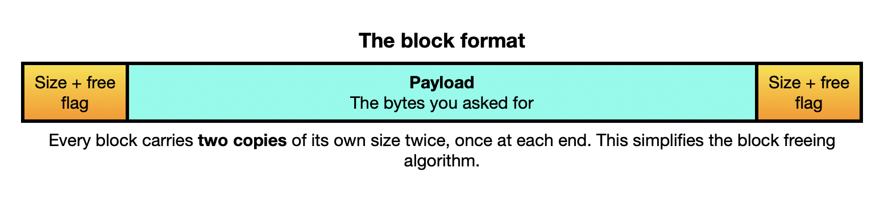
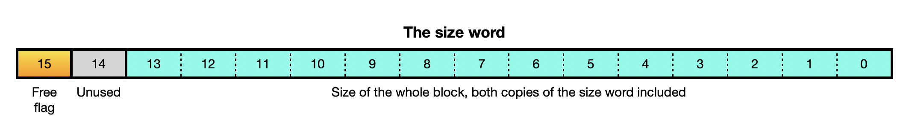
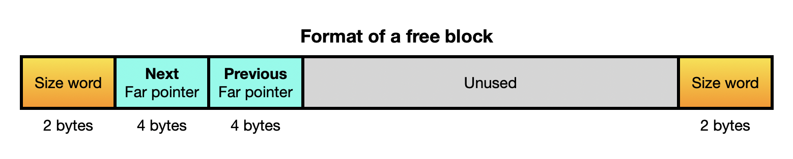
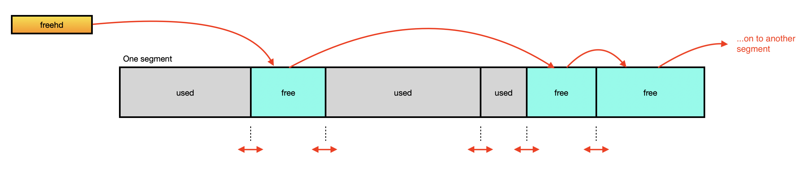

# Internals — how the mapper heap works

How `alloc.as` is built inside: the memory model it sits on, the shape of the
data it keeps, and the algorithms that allocate and free.

## How to read this document

It is in two layers.

- **Part 1 — the model.** Prose, with a worked example traced from an empty
  heap through two allocations and two frees, showing what every structure
  contains at each step. No byte offsets are needed to follow it. Part 1 on
  its own is enough to reason about the library or to discuss a change to it.
- **Part 2 — the reference.** The equates, the exact byte layouts, the
  algorithms in shorthand, the variable arrangement, and the design limits.
  Use it when writing code, not when trying to understand the design.

Read [README.md](../README.md) first for the public interface and the
far-pointer layout.

### Words used in this document

| word | what it means here |
|---|---|
| segment | one 16 KB unit of mapper RAM: the unit in which MSX-DOS2 allocates it |
| window | page 2 of the Z80 address space, 8000h–BFFFh, where the library makes one segment visible at a time |
| far pointer | the 4-byte name of a byte in mapper RAM: slot, segment, offset |
| block | one unit of heap memory: a size word, the caller's bytes, another size word |
| payload | the bytes of a block the caller may use — what `halloc` returns a pointer to |
| header, footer | the two size words at a block's front and back, each holding the whole block's size and a flag saying whether the block is free |
| free list | the chain that strings all free blocks together, so `halloc` can find them |
| end marker | a permanently-"used" mini-block at each end of a segment, there to stop merging from running off the edge (in the source it is called a *fence*) |
| merging | joining a block being freed to the free blocks physically next to it, so the space comes back as one larger block (the general technique is called *coalescing*) |

---

# Part 1: the model

## 1.1 What the hardware gives us

An MSX memory mapper presents its RAM in 16 KB segments. Which segment appears
in which Z80 page is chosen by writing a segment number to an I/O port: FCh
for page 0, FDh for page 1, FEh for page 2, FFh for page 3. A machine can have
several mappers, each in its own slot, and one of those slots may be an expanded
slot.

Three facts about that hardware shape everything in `alloc.as`:

**Only page 2 is available as a window.** The bottom 256 bytes of page 0 hold
the system vectors, among them the BDOS entry point at 0005h. MSX-DOS loads a
`.com` program at 0100h, so the rest of page 0 holds the beginning of the
program itself, and the program continues upward from there into pages 1 and 2,
if it's large enough. Page 3 holds the stack and MSX-DOS's work area. Remapping
page 0, 1 or 3 would replace memory the running program depends on: the system
vectors, the instructions being executed, or the stack. That leaves page 2,
8000h–BFFFh, and it can show exactly one 16 KB segment at any moment.

This places one requirement on a program that uses the library: everything it
needs permanently addressable (its code, its variables and its buffers) must
end below 8000h. From `heapinit` onward, that address range shows mapper
segments rather than the program's own memory.

**The mapper ports are shared and write-only.** A write to port FEh goes into
*every* mapper's page-2 register at once; only the mapper whose slot is
currently selected in page 2 actually shows its RAM. So a mapper cannot be
relied on to remember its segment across a slot switch. The right order is
always: select the slot first, then set the segment.

**Reaching a mapper other than the built-in one needs a slot switch,** done
through the BIOS routine `ENASLT`, which is reachable under MSX-DOS through
the jump vector at 0024h. That is a much more expensive operation than a
segment change.

## 1.2 Page 2 needs to be restored before calling MSX-DOS

MSX-DOS2 keeps its own record of what page 2 holds and does its own bank
switching. Because of this, banking the window with a raw `out (0feh),a`
is likely to cause crashes because the memory mappings don't match what
MSX-DOS2 has in its records.

Three rules follow, and the whole library is built around them:

1. The programmer needs to call `p2restore` before every BDOS call and before
   the program exits. This restores MSX-DOS's slot *and* segment, and marks
   the window record stale.
   
2. Segment selection goes through MSX-DOS2's own `PUT_P2` routine, never a raw
   `out`, so MSX-DOS's record tracks reality even in the middle of an
   operation.
   
3. The internal routine that claims a segment calls `p2restore` before asking
   MSX-DOS for it — an MSX-DOS service must always find a page 2 it owns.

## 1.3 The two layers of `alloc.as`

The file has a lower layer and an upper layer, and the split is worth keeping
in mind because they solve unrelated problems.

The **mapper layer** deals with the hardware: find MSX-DOS2's mapper support
routines at start-up (`mapinit`), claim a fresh segment when the heap needs to
grow (`allocseg`), put a given segment in the window (`deref`), and give page 2
back (`p2restore`). It knows nothing about blocks.

The **heap layer** deals with blocks: write the starting structure into a newly
claimed segment (`newseg`), find a free block and divide it (`halloc`), return
one and merge it with its neighbours (`hfree`), with two small helpers that add
a block to the free list (`fladd`) and take one out (`flremove`). It never
touches a mapper port; when it needs to see something it calls `deref`, exactly
as your program does.

All of these live in `alloc.as`. Only `heapinit`, `halloc`, `hfree`, `deref`,
`p2restore`, `maptot` and the word `hblocks` are public.

## 1.4 How a block is built: a size word at each end

Every block carries its own size **twice** — once at the front, once at the
back. Each of those two words also carries one flag bit saying whether the
block is free.





**Bit 14 is unused.** The largest block the library will ever build is
a whole fresh segment, 3FF8h bytes, which is below 4000h, so the size always
fits in the bottom fourteen bits. Nothing in `alloc.as` reads or writes bit 14.
It may be used in a future version of this library.

Storing the size at both ends looks wasteful (4 bytes per block) but it is
what makes freeing fast. Blocks sit back to back inside a segment with nothing
between them, so:

- the block **after** this one starts at *this block's address + this block's
  size*;
- the 2 bytes **before** this block are the previous block's back size word,
  which gives that block's size, and therefore its starting address.

Both neighbours are found by arithmetic alone. No list of blocks is needed,
and no search.

A block that is **free** has no payload to protect, so the library stores two
far pointers in the first 8 bytes of it — the links that string free blocks
together:



This is why no block is ever smaller than 12 bytes: 2 for the front size word,
4 and 4 for the two links, 2 for the back size word.

## 1.5 Two structures, two jobs

There are two entirely separate ways of getting from one block to another. The
two must not be confused:

- **The free block list**: the `next`/`prev` links. Answers *"where is there free
  space?"*. It connects all the free blocks in the heap, in no particular order,
  in any segment. `freehd`, a far pointer in ordinary RAM, points at the first
  one. It is a doubly-linked list so that a block in the middle of it can be
  unlinked without walking from the head.
  
- **Physical adjacency**: the size words. Answers *"what is next to this
  block in real memory?"*. It never leaves the segment.

`halloc` uses the first. `hfree` uses the second to decide what to merge, then
uses the first to keep the list correct.



## 1.6 How a segment is prepared

When the heap needs more room it asks MSX-DOS2 for a fresh 16 KB segment and
writes a fixed pattern into it: a 4-byte permanently-used **end marker** at
each end, and one big free block filling everything between them.

```
  0000h  [ end marker: used, 4 bytes ]
  0004h  [ one free block, 3FF8h bytes = 16376 ]
  3FFCh  [ end marker: used, 4 bytes ]
                 total 4000h = 16384
```

The end markers exist for exactly one reason. When `hfree` merges, it looks at
the neighbouring block's flag and merges if it says "free". At the edge of a
segment it meets an end marker, sees "used", and stops. There is not one
bounds check anywhere in `hfree`. The data structure makes the check
unnecessary.

A block never straddles two segments. That is not a rule enforced by code; it
is impossible by construction: each segment has its own pair of end markers,
and a block is always taken from free space between them. This is
also why the largest possible block is 16372 bytes: 16376 of usable segment,
less the 4 bytes of the block's own size words.

---

# Part 2 — the reference

## 2.1 Equates

From `alloc.as`:

| equate | value | meaning |
|---|---|---|
| `BLKHDR` | 0000h | header (front size word) offset within a block |
| `BLKPAY` | 0002h | payload start — what `halloc` returns, what `hfree` receives |
| `BLKNEXT` | 0002h | free block: offset of the `next` far pointer |
| `BLKPREV` | 0006h | free block: offset of the `prev` far pointer |
| `OVERHEAD` | 4 | the two size words |
| `MINBLK` | 12 | 2 header + 4 next + 4 prev + 2 footer |
| `FREEBIT` | 8000h | bit 15 of a size word = "this block is free". Bit 14 is always zero, since no block exceeds 3FF8h; bits 13–0 hold the size |
| `SEGSIZE` | 4000h | 16 KB |
| `FENCE` | 4 | size of an end marker (simulates a used block with no payload) |
| `WIN` | 8000h | page-2 window base address |
| `BIGSZ` | 3FF8h | `SEGSIZE - FENCE - FENCE` — the big free block in a fresh segment |

From `farptr.inc`:

| equate | value | meaning |
|---|---|---|
| `NULLOFF` | FFFFh | offset value meaning "this far pointer points at nothing" |

MSX system addresses used, all in `alloc.as`:

| name | value | what it is |
|---|---|---|
| `ENASLT` | 0024h | MSX-DOS jump vector to the BIOS slot-select routine |
| `HOKVLD` | FB20h | extended-BIOS "hooks are valid" flag; bit 0 |
| `EXTBIO` | FFCAh | extended-BIOS entry point |

## 2.2 Far pointer layout

```
+0  slot address     bit 7 = expanded flag, bits 3-2 = subslot, bits 1-0 = primary
+1  segment number   0-255 within that mapper
+2  offset low       \  0000h-3FFFh within the segment
+3  offset high      /  offset FFFFh = null; slot and segment then meaningless
```

The slot-and-segment pair is exactly what MSX-DOS2's `ALL_SEG` returns, so a
far pointer carries the full physical identity of its segment — any mapper, any
slot, with no translation table anywhere.

## 2.3 Start-up: `heapinit` and `mapinit`

`heapinit` calls the internal `mapinit` and, if that succeeds, empties the free
list and zeroes `hblocks`. `mapinit` does:

```
if bit 0 of HOKVLD is 0:   fail          ; no extended BIOS -> no mapper
EXTBIO function 0401h  ->  primslt (the primary mapper's slot address)
                           varptr  (address of the mapper variable table)
EXTBIO function 0402h  ->  copy the 16-entry jump table (48 bytes) locally
GET_P2                 ->  p2orig        ; what MSX-DOS has in page 2 now
mapready := 1
```

The **mapper variable table** at `varptr` lives in the MSX-DOS system area in
page 3, so it is never banked out and can be read at any time. Each entry is 8
bytes: +0 slot address (0 marks the end of the table), +1 total segments, +2
free, +3 system, +4 user. `maptot` simply adds up the +1 bytes.

The **jump table** (`ALL_SEG`, `FRE_SEG`, `RD_SEG`, … `GET_P3`, 3 bytes each,
order fixed by the MSX-DOS2 specification) is copied into the module so that
its entries can be called directly. It is the only variable data that lives in
the **code segment** rather than the data segment, because its entries are
*executed*: each is a `jp` instruction written at run time.

`mapready` guards `p2restore`: before `mapinit` has finished there is nothing
to restore and the jump table is empty, so `p2restore` returns immediately.

## 2.4 Claiming a segment: `allocseg`

`ALL_SEG` takes a slot address in `B` with strategy bits embedded in it
(`FxxxSSPP`, strategy in bits 6–4). Strategy `010` means "try the slot I name,
then try any other mapper", so a single call covers the whole machine:

```
p2restore                       ; an MSX-DOS service is about to run
B := primslt OR 20h             ; primary mapper's slot + strategy 010
A := 0                          ; want a user segment
ALL_SEG                         ; CY = every mapper full
                                ; else A = segment number, B = actual slot
```

Passing the explicit slot rather than `B = 0` matters: `ALL_SEG` then returns
the real slot address in `B`, which is precisely the byte the far pointer
needs.

## 2.5 The window: `deref`

`deref` keeps a one-entry record of what the window is showing — `cur_slot`,
`cur_seg`, and `curvalid`, which is 0 until the first mapping and is reset by
`p2restore`. Three paths:

```
                requested (slot, segment) against the record
                 |
   record stale, or slot differs ------- FULL:  ENASLT the slot into page 2,
                 |                              then PUT_P2 the segment
   slot same, segment differs ---------- CHEAP: PUT_P2 the segment only
                 |
   both the same ----------------------- FREE:  nothing to do

then in all three cases: HL := 8000h + offset
```

This record is what makes far pointers practical to use: walking a chain
inside one segment costs a few compares per step, and even crossing segments
within one mapper skips the expensive slot switch. It is sound because the
library is the only thing that writes the window between `p2restore` calls, and
every path that hands control to MSX-DOS goes through `p2restore`, which marks
the record stale.

## 2.6 `p2restore`

```
if mapready = 0: return
ENASLT primslt into page 2        ; MSX-DOS's slot
PUT_P2 p2orig                     ; MSX-DOS's segment, through MSX-DOS, so
                                  ;   its own record agrees with the hardware
curvalid := 0                     ; the next deref must map afresh
```

## 2.7 Preparing a fresh segment: `newseg`

```
allocseg                          ; CY = out of mapper memory, give up
write end marker at offset 0000h: size 4, used
write one free block at offset 0004h: size 3FF8h, free
write end marker at offset 3FFCh: size 4, used
link the big block in at the head of the free list
```

Net capacity per segment is 3FF8h (16376) bytes, so the largest payload is
3FF8h − 4 = 16372 bytes.

## 2.8 `halloc`

```
need := max(requested + OVERHEAD, MINBLK)
if need > BIGSZ: fail (CY)                   ; can never fit in one segment
loop:
    walk the free list for the first block with size >= need   ; first-fit
    if none found:
        newseg                                ; claim a segment and prepare it
        if that failed: fail (CY)
        restart the walk                      ; the new 3FF8h block will match
rem := block.size - need
if rem >= MINBLK:
    SPLIT:  rewrite the free block's two size words to rem, in place
            take the new block from its TAIL, at offset + rem
            (the free list is not touched at all)
else:
    WHOLE:  flremove the block from the free list
            clear the free bit in both its size words
hblocks := hblocks + 1
return a far pointer to the payload, at block + BLKPAY
```

`hblocks` is incremented only on this success path; the failure exits return
having allocated nothing.

## 2.9 `hfree`

```
hblocks := hblocks - 1            ; done first, but only after the caller's
                                  ;   far pointer has been copied out of HL
header := payload - BLKPAY
size   := header.size

FORWARD:   neighbour := header + size
           if neighbour is free:
               flremove neighbour
               size := size + neighbour.size

BACKWARD:  left neighbour's footer is the word at header - 2
           if it says free:
               flremove that neighbour
               header := header - its size
               size   := size + its size

write (size OR FREEBIT) into the merged block's header and footer
fladd the merged block at the head of the free list
```

`flremove` unlinks a block by rewiring `prev.next` and `next.prev`, treating
`freehd` as the previous block's `next` field when the block being removed is
the head. `fladd` pushes a block on at the head.

Every neighbour's size and every link is copied into ordinary RAM before any
far pointer is followed, for the reason given at the end of Part 1.

## 2.10 Variables: one data segment, with overlays

All the library's variables are in a single data segment at the end of the
file — except the jump table, which is in the code segment because it is
executed (see 2.3).

The permanent state is small: `primslt`, `varptr`, `p2orig`, `mapready`, the
window record (`curvalid`, `cur_slot`, `cur_seg`), the counter `hblocks`, and
`freehd`, which is the heap's only durable variable.

The per-call working variables are **overlaid**: several labels name the same
storage, in cases where the routines that own them can never be active at the
same time. Three regions:

1. **`deref` scratch** — `fp_slot`, `fp_seg`, `fp_off`, 4 bytes. Private.
   `deref` is called by everything else, so it shares with nobody.
2. **The helper region** — 8 bytes, shared by `newseg`'s `tmpfp`, `fladd`'s
   `fablk`, and `flremove`'s `frnext` and `frprev`. None of those three
   helpers calls another, so at most one of them is live at a time.
3. **The top-level frame** — 20 bytes, where `halloc`'s scanning and splitting
   variables share storage with `hfree`'s merging variables. The two public
   entry points can never both be part-way through.

Region 3 must **not** be merged into region 2: `hfree` calls `flremove` while
its own `hfprev` is still live, so those two sets of variables have to be
distinct.

The overlays hold the working storage to 32 bytes rather than the 56 the same
variables would occupy separately, and each routine still refers to its own
descriptive names. They carry one consequence: the library is **not
reentrant**, because its working variables are fixed storage, so it must not
be called from an interrupt handler, and no routine it calls may call back
into it.

## 2.11 Design limits, and why

| limit | value | why |
|---|---|---|
| largest block | 16372 bytes | a block cannot span two segments; 16376 usable per segment, less 4 bytes of size words |
| smallest block | 8 bytes of payload | a free block must hold two 4-byte links plus its two size words, so 12 bytes total |
| overhead per block | 4 bytes | the two size words |
| search strategy | first-fit | simple and fast for mixed sizes; a segment that held large blocks keeps a reusable gap at its front |
| merging | within one segment only | end markers stop it at the edges; blocks in different segments are not adjacent memory |
| segments per mapper | 255 of 256 | MSX-DOS2's segment counts are byte-sized, so it manages 0–254 and never allocates segment 255. The segment exists and is addressable; MSX-DOS2 has no record of it. |
| segments returned | never, during the run | MSX-DOS2 frees a program's user segments when it terminates |
| reentrancy | none | fixed working storage; not callable from an interrupt handler |

One more property worth stating because it is a design choice rather than an
accident: every segment the heap uses comes from MSX-DOS2's own allocator, so
the heap coexists with the RAM disk, with resident utilities, and with MSX-DOS2
itself. The library never takes memory MSX-DOS2 has not offered it.
